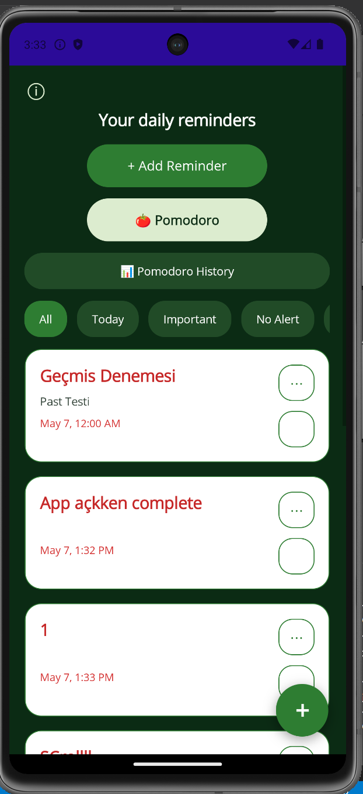
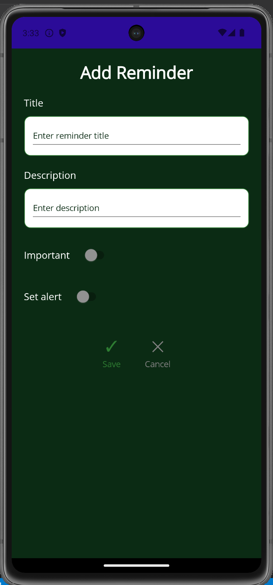
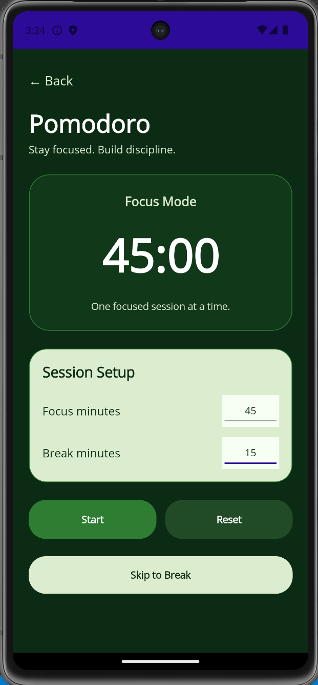
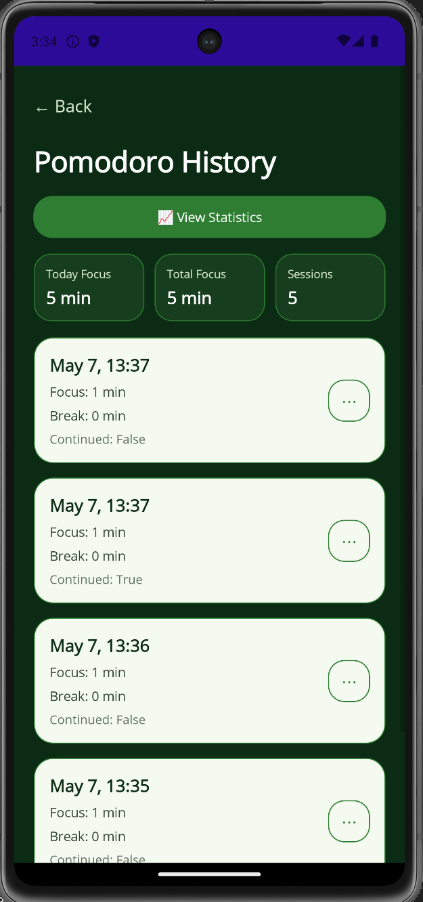
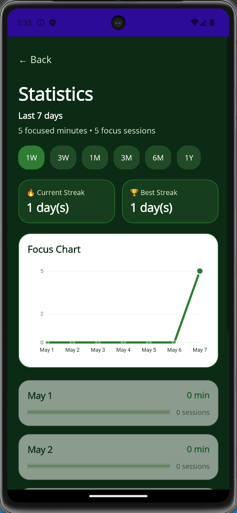
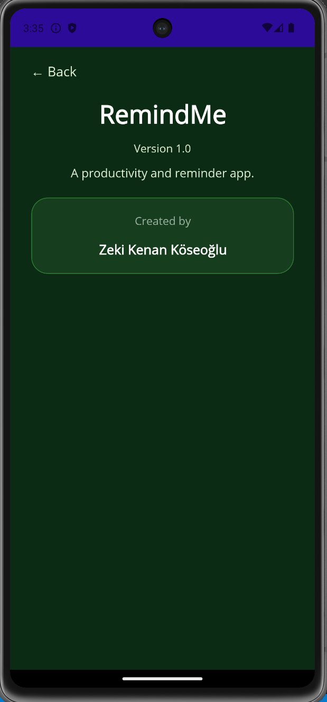

# RemindMe

RemindMe is a productivity and reminder application built with .NET MAUI and C#.

The app helps users manage reminders, track completed tasks, and stay productive using an integrated Pomodoro timer system.  
This project was developed as a personal portfolio project to improve mobile development, UI design, and application architecture skills.

---

# Features

## Reminder System

- Create reminders
- Edit reminders
- Delete reminders
- Restore completed reminders
- Mark reminders as completed
- Undo completed actions
- Important reminders
- Reminder filtering system
- Past reminder detection
- No-alert reminders

## Notifications

- Local notifications
- Scheduled reminder alerts
- Notification action handling
- Automatic notification cancellation

## Pomodoro System

- Pomodoro timer
- Pomodoro session tracking
- Pomodoro history page
- Productivity statistics

## UI / UX

- Custom dark green theme
- Floating action button
- Responsive card-based layout
- About page
- Custom app icon and splash screen
- Smooth reminder interaction system

---

# Screenshots

## Home Page



## Add Reminder Page



## Pomodoro Page





## About Page



---

# Technologies Used

- .NET MAUI
- C#
- XAML
- SQLite
- CommunityToolkit.Maui
- Plugin.LocalNotification

---

# Project Structure

```text
Pages/
Models/
Services/
Resources/
Platforms/
```
